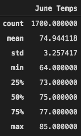
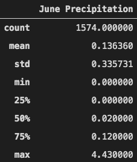

# **surfs_up**  


## **Overview of Project**
We performed this analysis to help a friend decide about his business plan. He wants to open a place in an island in Hawaii, serving surf boards and ice cream. He needs to know if the weather condition is suitable for such an investment in that area. 


### **Purpose**

we have been provided with a SQlite database ([hawaii.sqlite](hawaii.sqlite)) containing information about the weather in the area of interest. There are two tables in this database, "station" and "measurement", (Fig. 1 & Fig. 2):


<center>

|*Fig. 1: station*|
:--:
||

|*Fig. 2: measurement*|
:--:
||
</center>
&nbsp;

The "station" table contains data regarding nine weather stations in the area, while, "measuremenr table" has the data recorded in those stations, "precipitation" and "temperature" on daily basis between 2010-01-01 and 2017-08-23. We used the data in this database to perform some analysis and provide an insight about the weather condition in the area of interest.
&nbsp;

## **Results**  

To perform the analysis we used Jupyter notebook, Python and SQLAlchemy (to connect to the database and write the queries).
The main idea is to select the temperatures recorded in June (beginning of the summer) and compare them to those recorded in December (end of autumn) to see how the weather has been different through the year in the past years (2010-2017):
First we made a connection to our database and reflected the tables in the database into our code using SQLAlchemy and the code below:

```py
engine = create_engine("sqlite:///hawaii.sqlite")

# reflect an existing database into a new model
Base = automap_base()
# reflect the tables
Base.prepare(engine, reflect=True)

# Save references to each table
Measurement = Base.classes.measurement
Station = Base.classes.station
```
Then the data was filtered for the recordings of June between 2010-2017 and assigned to a dataframe. Finally using the dataframe a summary of statistics table was created for the June temperatures (Fig. 3). Here is the code for this part of the analysis:

```py
# Import the sqlalchemy extract function.
from sqlalchemy import extract

# Write a query that filters the Measurement table to retrieve the temperatures for the month of June. 
results_june = session.query(Measurement.tobs).filter(extract('month', Measurement.date) == 6).all()

#  Converting the June temperatures to a list.
results_june = list(np.ravel(results_june))

# Creating a DataFrame from the list of temperatures for the month of June. 
df_jun = pd.DataFrame(results_june, columns=['June Temps'])

# Calculating and print out the summary statistics for the June temperature DataFrame.
df_jun.describe()
```

<center>

|*Fig. 3: Summary Statistics for the June Temperature*|
:--:
||
</center>

&nbsp;


Using the same code we also provided a summary of statistics table for the December temperatures (Fig. 4).

&nbsp;
<center>

|*Fig. 4: Summary Statistics for the December Temperature*|
:--:
||
</center>
&nbsp;


By comparing Fig. 3 with Fig. 4:  
- There are almost 200 more recordings for temperature in June 
- The Average of the temperatures recorded in June is around 75 °F while it is 71 °F in December
- The minimum temperature recorded in June is approximately 10 degrees °F higher than The minimum temperature recorded in December
- 75 percent of the temperatures recorded in December are between almost 70 °F and 83 °F and in June we have the same percentage of the data between 73 °F and 85 °F

&nbsp;

The Juoyter notebook file for this analysis can be fined in: [SurfsUp_Challenge.ipynb](SurfsUp_Challenge.ipynb)

## **summary**  

- According to the analysis above and its results it could be concluded that there has been no big change in weather condition through the year in the past years regarding the temperature.
- We are still not sure about the amount of precipitation. To compare this parameter in June and December, we wrote two more queries to retrieve the precipitation recordings in these two months and compare the histograms of the recordings in each month between 2010 and 2017. Below you can see the code to get the precipitation recordings in June and december and add them to two dataframes ("[Additionals_Queries.ipynb](Additionals_Queries.ipynb)" containes the code for this additional part):  

    ```py
    prec_june = session.query(Measurement.prcp).filter(extract('month', Measurement.date) == 6).all()
    prec_june = list(np.ravel(prec_june))
    df_prec_june = pd.DataFrame(prec_june, columns=['June Precipitation'])


    prec_dec = session.query(Measurement.prcp).filter(extract('month', Measurement.date) == 12).all()
    prec_dec = list(np.ravel(prec_dec))
    df_prec_dec = pd.DataFrame(prec_dec, columns=['December Precipitation'])
    ```
    &nbsp;
<center>

|*Fig. 5: a)Summary Statistics for the June Precipitation*|*b)Histogram for the June Precipitation*|
|:--:|:--:|
|||
</center>
&nbsp;

<center>

|*Fig. 6: a)Summary Statistics for the December Precipitation*|*b)Histogram for the December Precipitation*|
|:--:|:--:|
|||
</center>
&nbsp;

- Comparing Fig. 5 and Fig. 7 demonstrates that there is no significant change in the amount of precipitation in June and december.
- Generally it seems that there has been no serious climate change during the year in the past years, as we've almost had the same weather condition in a cold month of the year that we've had in a warm month, hopefully it will be the same for the years to come. We can tell our friend that it is safe to invest in this place and open his surf board and ice cream business as it can be an all year round business .
